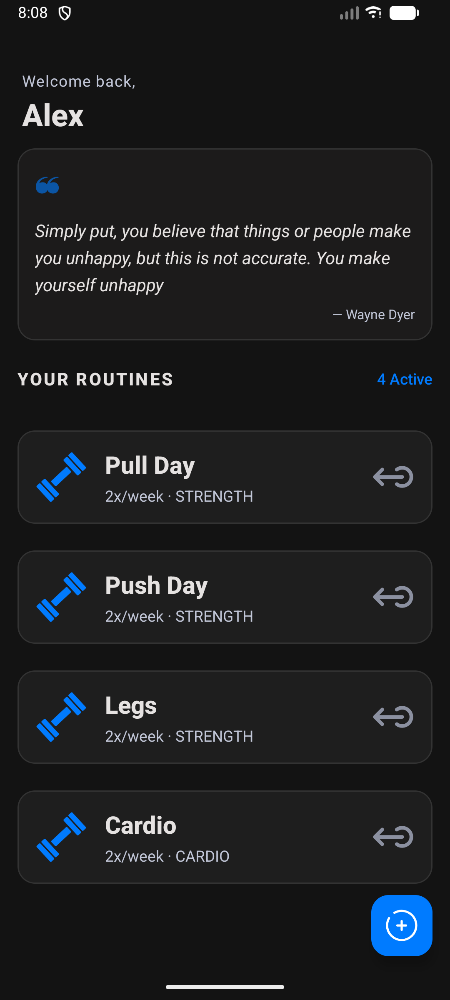
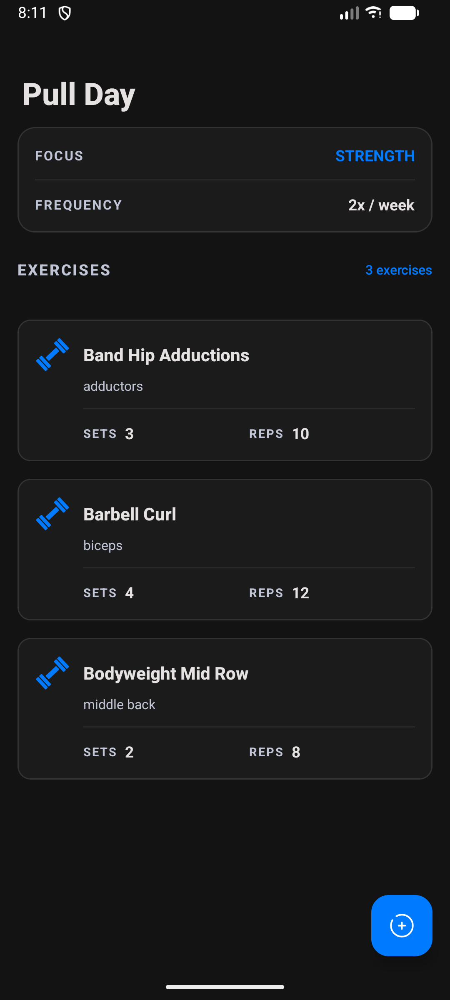
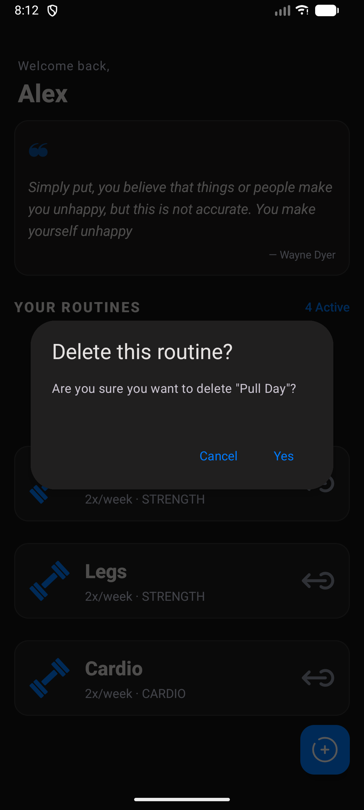
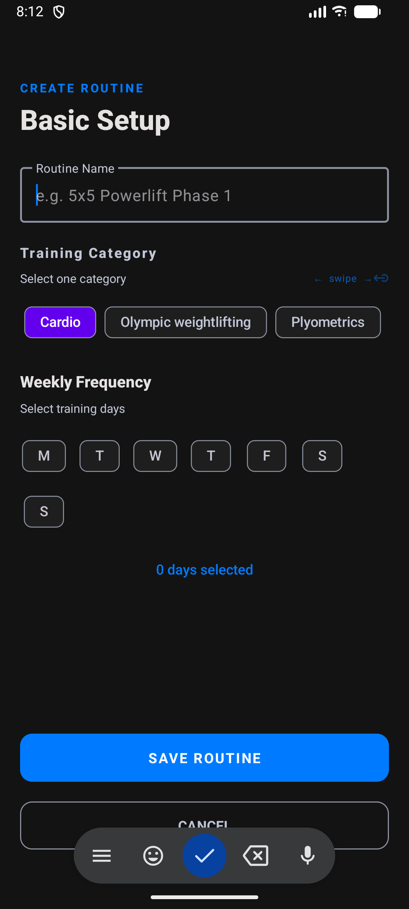
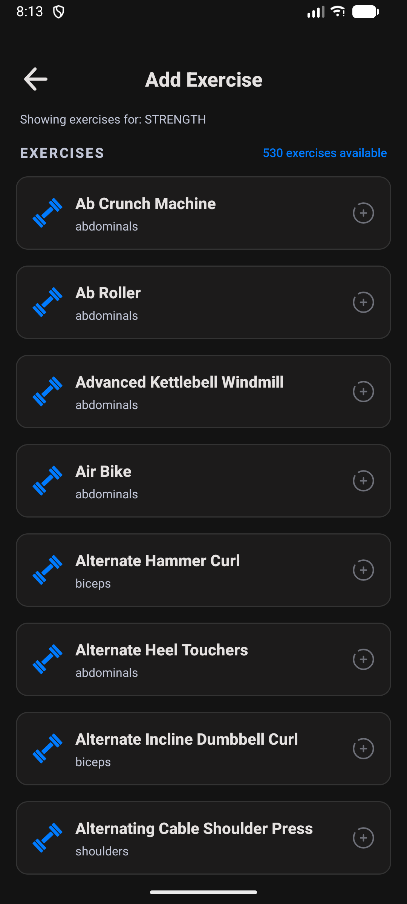
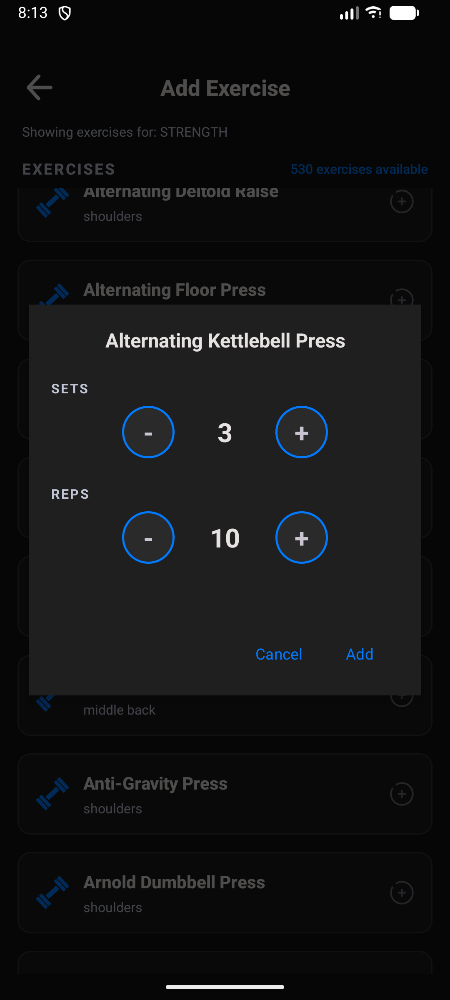

# 💪 RepsRex App – Android Kotlin

**Descripción:**  
Aplicación nativa de Android desarrollada en Kotlin para la gestión de rutinas de entrenamiento y ejercicios (Fitness App). Permite crear rutinas personalizadas y añadir ejercicios con series y repeticiones.

---

## 📌 Funcionalidades

### 🔹 v1.0
- Gestión de ejercicios (catálogo predefinido)
- Creación de rutinas de entrenamiento personalizadas
- Añadir ejercicios a rutinas con series y repeticiones
- Visualización de detalle de rutina
- Persistencia local (Room Database)
- Diseño moderno con **Material Design**

---

## 🛠 Tecnologías utilizadas

- **Kotlin**
- **Android Studio**
- **RecyclerView** + Adaptadores personalizados
- **Room Database** (Persistencia local)
- **LiveData / ViewModel** (Arquitectura MVVM)
- **Material Design Components**
- **ConstraintLayout**
- **Coroutines** (para operaciones asíncronas)
- **Navigation Component**

---

## 📷 Capturas de pantalla

### 🟢 v1.0 – Pantallas principales

<div align="center">
  <table>
    <tr>
      <td align="center">
        <br>
        <sub><b>Pantalla inicial</b><br>Lista de rutinas guardadas</sub>
      </td>
      <td align="center">
        <br>
        <sub><b>Detalle de rutina</b><br>Ejercicios y series asignadas</sub>
      </td>
    </tr>
    <tr>
      <td align="center">
        <br>
        <sub><b>Modal de confirmación</b><br>Eliminar rutina</sub>
      </td>
      <td align="center">
        <br>
        <sub><b>Crear rutina</b><br>Formulario para nueva rutina</sub>
      </td>
    </tr>
    <tr>
      <td align="center">
        <br>
        <sub><b>Añadir ejercicio</b><br>Catálogo de 530+ ejercicios</sub>
      </td>
      <td align="center">
        <br>
        <sub><b>Configuración de series</b><br>Series y repeticiones por ejercicio</sub>
      </td>
    </tr>
  </table>
</div>

---

## 📌 Estado del proyecto

| Versión | Estado | Funcionalidades |
|---------|--------|-----------------|
| v1.0 | ✅ Completado | Gestión de ejercicios + Creación de rutinas + Persistencia |

---

## 📝 Lo que aprendí

- Diseño de esquema de base de datos relacional (Ejercicios - Rutinas - EjerciciosRutina)
- Implementación de **Room Database** con relaciones (Foreign Keys)
- Uso de **LiveData** y **ViewModel** para arquitectura MVVM
- Gestión de estado complejo (rutinas + ejercicios + series)
- Creación de interfaces de usuario para formularios dinámicos
- Navegación entre fragments con **Navigation Component**
- Persistencia de datos locales con Coroutines
- Manejo de listas anidadas (RecyclerView dentro de otro RecyclerView)

---

## 🚀 Cómo ejecutar

```bash
git clone https://github.com/GualpaJ/RepsRex-Android.git
